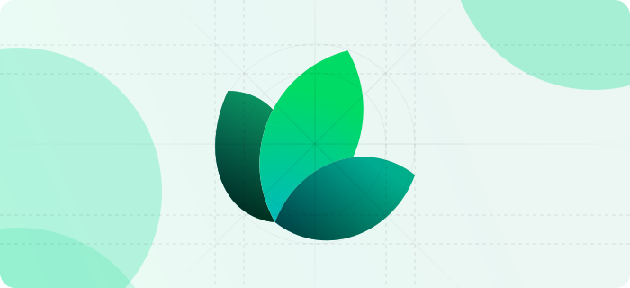
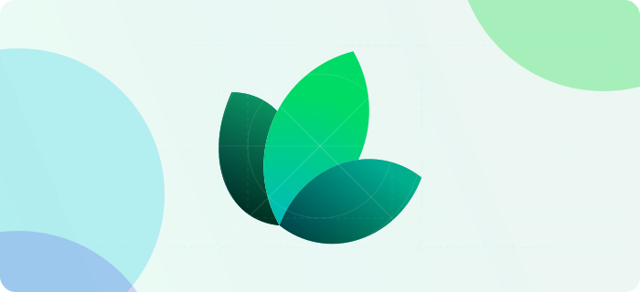

Highlight is an analytics & monitoring tool for the next generation of developers. And it's all [open source](https://github.com/highlight/highlight) :).

<Card horizontl title="Get Started" icon="link" href="/content/components/card-group">
Get started with https://highlight.io. Instrument your frontend and backend.
</Card>

## Our product

[highlight.io](https://highlight.io) gives you **fullstack** visibility into your application by pairing session replay, error monitoring, and logging, allowing you to tie frontend issues with backend logs and performance issues.

When highlight.io is fully integrated, this is what it looks like:

<EmbeddedVideo 
  src="https://www.youtube.com/embed/EvGsmbt0F7s"
  title="Youtube Video Player"
  allow="accelerometer; clipboard-write; encrypted-media; gyroscope; picture-in-picture; web-share"
/>

### About us

<DocsCardGroup>
    <DocsCard title="Mission & Values." href="./2_company/1_values.md">
        {"Details about our company, our values, and open source."}
    </DocsCard>
    <DocsCard title="Compliance & Security."  href="./2_company/compliance-and-security.md">
        {"Our security certificates, and contact details."}
    </DocsCard>
    <DocsCard title="Contributing to highlight.io"  href="./2_company/open-source/contributing.md">
        {"Open source, self hosting highlight, and contributing."}
    </DocsCard>
    <DocsCard title="Self hosting highlight.io"  href="./4_company/open-source/hosting/2_self-host-hobby.md">
        {"Open source, self hosting highlight, and contributing."}
    </DocsCard>
</DocsCardGroup>

### Features

<DocsCardGroup>
    <DocsCard title="Session Replay." href="./6_product-features/1_session-replay/1_overview.md">
        {"Session replay features, how to get started, etc.."}
    </DocsCard>
    <DocsCard title="Error Monitoring."  href="./6_product-features/2_error-monitoring/1_overview.md">
        {"Error monitoring features, how to get started, etc.."}
    </DocsCard>
    <DocsCard title="Logging."  href="./6_product-features/4_logging/1_overview.md">
        {"Logging features, how to get started, etc.."}
    </DocsCard>
    <DocsCard title="Tracing."  href="./6_product-features/5_tracing/1_overview.md">
        {"Tracing features, how to get started, etc.."}
    </DocsCard>
</DocsCardGroup>


<Note>
  If you're not looking to build API reference documentation, you can delete
  this section by removing the api-reference folder.
  testing
</Note>

## Welcome

There are two ways to build API documentation: [OpenAPI](https://mintlify.com/docs/api-playground/openapi/setup) and [MDX components](https://mintlify.com/docs/api-playground/mdx/configuration). For the starter kit, we are using the following OpenAPI specification.

<Card
  title="Plant Store Endpoints"
  icon="leaf"
  href="https://github.com/mintlify/starter/blob/main/api-reference/openapi.json"
>
  View the OpenAPI specification file
</Card>

## Authentication

All API endpoints are authenticated using Bearer tokens and picked up from the specification file.

```json
"security": [
  {
    "bearerAuth": []
  }
]
```





## Setting up

The first step to world-class documentation is setting up your editing environments. Making a test.

<CardGroup cols={2}>
  <Card
    title="Edit Your Docs"
    icon="pen-to-square"
    href="https://mintlify.com/docs/quickstart"
  >
    Get your docs set up locally for easy development
  </Card>
  <Card
    title="Preview Changes"
    icon="image"
    href="https://mintlify.com/docs/development"
  >
    Preview your changes before you push to make sure they're perfect
  </Card>
</CardGroup>

## Make it yours

Update your docs to your brand and add valuable content for the best user conversion.

<CardGroup cols={2}>
  <Card
    title="Customize Style"
    icon="palette"
    href="https://mintlify.com/docs/settings/global"
  >
    Customize your docs to your company's colors and brands
  </Card>
  <Card
    title="Reference APIs"
    icon="code"
    href="https://mintlify.com/docs/api-playground/openapi"
  >
    Automatically generate endpoints from an OpenAPI spec
  </Card>
  <Card
    title="Add Components"
    icon="screwdriver-wrench"
    href="https://mintlify.com/docs/components/accordion"
  >
    Build interactive features and designs to guide your users
  </Card>
  <Card
    title="Get Inspiration"
    icon="stars"
    href="https://mintlify.com/customers"
  >
    Check out our showcase of our favorite documentation
  </Card>
</CardGroup>
